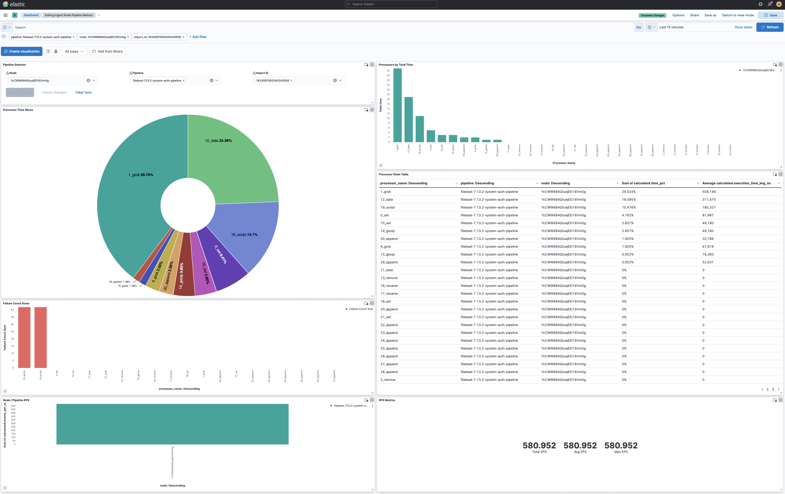

# Elasticsearch Ingest Node Pipeline Metrics

This utility denormalizes Elasticsearch nodes stats to create one document
for every ingest processor in each pipeline on each node.

## Usage

```
curl -o nodes_stats.json http://localhost:9200/_nodes/stats
curl -o pipelines.json http://localhost:9200/_ingest/pipeline

go install github.com/andrewkroh/go-ingest-node-metrics@latest
$(go env GOPATH)/bin/go-ingest-node-metrics -pipelines-json=./pipelines.json nodes_stats.json
```

## Dashboard

Use the save objects import feature in Kibana to import the dashboard.ndjson
file.


